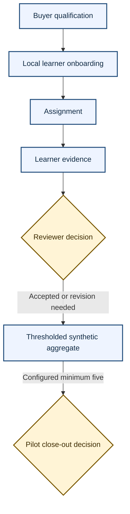

# Engineering Mastery Lab Pilot Readiness

**Revision:** Rev00

**Date:** 2026-08-08

**Status:** Public-safe paid-service pilot baseline
**Data boundary:** Synthetic readiness verification only for this task; no real cohort, live learner data or live pilot operation is authorised

## Purpose and buyer problem

This pilot tests whether Engineering Mastery Lab can support a small, facilitated engineering-learning engagement with evidence that participants retain themselves. It is intended for an educator, engineering team lead or learning operator who needs a structured path from learning through practical work to reviewable evidence, but does not need a hosted learning-management system.

The pilot is a paid delivery and facilitation service around the current local-first product. It is not a hosted production product, account service, credential, accreditation pathway or claim of verified workplace competency.

This document plans a possible future service pilot. The current readiness task authorises synthetic verification only. It does not authorise recruiting participants, processing live learner data, operating a real cohort or commencing the service.

## Current evidence-backed capability

The current product provides a self-contained Engineering Academy, pathways, laboratories, project briefs, bounded engineering tools, learner-controlled progress and evidence records, and local JSON and Markdown exports. The open-source-preview entitlement exposes every current feature. Browser or desktop-webview records remain local, and the desktop filesystem and process boundary remains limited to its existing typed Tauri authority.

The Pricing page contains forward-looking Free, Pro and Teams or Educators metadata. It has no checkout, payment collection or numeric price. Hosted identity, synchronisation, billing, collaboration, real cohorts, educator analytics and telemetry are unavailable.

## Editable planning baseline

| Assumption | Pilot baseline | How to change it |
|---|---|---|
| Duration | 4 weeks | Agree a revised delivery plan before acceptance |
| Participants | 5 to 10 learners | Do not exceed 10 in this pilot design; fewer than 5 cannot release an aggregate |
| Delivery | Facilitated, local-first | Define meeting format and local support channel in the private statement of work |
| Evidence | Learner-retained local records and exports | Agree evidence examples and review rubric during onboarding |
| Cohort reporting | Manual review plus synthetic dry-run proof | Do not represent synthetic aggregates as real participant analytics |

These are editable pilot assumptions, not product limits, promised availability or validated efficacy claims.

## Reusable client-facing commercial placeholder

Pilot fee: [PILOT FEE] plus GST if applicable.

The placeholder must remain in reusable client-facing copy until Saj approves an exact fee. Internal demand-test pricing and its rationale remain in the private commercial pack and are not tracked in this public repository.

## Intended audience and qualification

The pilot suits an Australian education or engineering-learning buyer who can nominate one accountable facilitator, recruit 5 to 10 consenting adult participants, support local browser or desktop use, define a bounded learning objective, and accept manual evidence review. It is not suitable where procurement requires single sign-on, central learner administration, cloud backup, automated educator dashboards, regulated assessment, remote proctoring, hidden telemetry or formal accreditation.

## Inclusions and exclusions

### Included

- pilot discovery, scope confirmation and facilitator onboarding;
- participant local-data briefing and product onboarding;
- one agreed learning pathway or bounded project focus;
- weekly facilitated check-ins and manual evidence review;
- participant-controlled JSON or Markdown export guidance;
- thresholded synthetic cohort dry run;
- close-out review against agreed acceptance criteria; and
- a limitations, risks and next-decision record.

### Excluded

- authentication, hosted storage or synchronisation;
- billing or checkout inside the product;
- collaboration or shared workspaces;
- real cohort services, educator analytics or telemetry;
- accreditation, certification, professional licensure or Engineers Australia endorsement;
- automated claims of learning efficacy or workplace competence;
- general CAD, FEM, CFD or AI tutor expansion;
- production engineering approval or safety acceptance; and
- changes to the MIT licence or the Tauri filesystem and process authority.

## Responsibilities

| Party | Responsibilities |
|---|---|
| Pilot facilitator | Confirm scope, provide the local-data briefing, schedule sessions, answer bounded product questions, apply the agreed review rubric, record manual decisions and escalate safety or access issues |
| Participant | Use synthetic or approved non-sensitive learning inputs, control local records, retain backups, submit only agreed evidence, report access needs and avoid placing confidential or personal data into synthetic fixtures |
| Buyer | Nominate the facilitator and participants, provide suitable devices and time, approve the evidence rubric, manage internal consent and policy obligations, and make the close-out decision |

## Operating sequence

1. **Onboarding:** qualify the buyer, confirm exclusions, agree the pathway, brief local data handling and accessibility needs, and establish participant export and recovery practice.
2. **Weekly operation:** participants complete assigned local learning and practical work; the facilitator holds one structured check-in, reviews learner-selected evidence and records decisions manually.
3. **Evidence review:** the reviewer checks the agreed criterion, labels evidence as accepted or revision needed, and avoids interpreting local completion as authenticated performance.
4. **Close-out:** compare manual measures with the acceptance criteria, collect participant-controlled exports where explicitly agreed, document limitations and decide whether to stop, repeat or design a separately authorised production phase.

## Pilot flow visual



Accessible text equivalent:

1. Qualify the buyer against the pilot audience, local-only boundary and exclusions.
2. Onboard each learner locally and explain data, export, recovery and accessibility responsibilities.
3. Assign the agreed bounded learning or project activity.
4. Each learner retains and selects local evidence.
5. A human reviewer records accepted or revision-needed decisions against the agreed rubric.
6. Release only a thresholded synthetic aggregate when the group meets the configured minimum of five learners; otherwise suppress participant and outcome counts. This threshold does not establish anonymity, non-identifiability or legal privacy compliance.
7. At close-out, the buyer decides to stop, repeat the service pilot or separately scope unresolved production gates.

## Manual success measures

The pilot uses no hidden telemetry. Before onboarding, the buyer selects the measures that matter and records their baselines. Suggested measures are:

- participant onboarding completed with the local-data boundary understood;
- planned weekly activities attempted and blockers recorded manually;
- agreed learner-selected evidence submitted for human review;
- review decisions and requested revisions traceable to the agreed rubric;
- participant export and recovery exercise completed on the nominated device;
- accessibility or usability blockers recorded with their affected task; and
- close-out decision supported by named evidence, limitations and unresolved risks.

Counts are manual service records, not authenticated product analytics. No measure should be presented as a causal efficacy result without a separately designed study.

## Acceptance criteria

The pilot is accepted when:

1. 5 to 10 participants can use the agreed local flow without an unavailable hosted capability being represented as present.
2. The facilitator completes the agreed onboarding, weekly review and close-out activities.
3. Each participant can produce the agreed local evidence or a recorded reason why not.
4. The buyer receives the agreed manual review record and limitations summary.
5. The synthetic dry run passes for five learners, suppresses the four-learner aggregate and passes the maximum ten-learner boundary.
6. No actor identifier appears in released thresholded aggregate output and no personal data enters the synthetic fixture.
7. A participant export and recovery check is completed using an agreed synthetic or non-sensitive record.
8. Accessibility and engineering-safety exceptions are recorded rather than silently accepted.

## Support and change boundary

Support covers onboarding, the agreed pathway, ordinary local export and recovery guidance, and reproducible product defects within the pilot scope. It excludes device administration, unsupported browsers, third-party media availability, operating-system remediation, external engineering tools, production engineering decisions and new product features. A material scope, cohort, schedule, integration or deliverable change requires written change control before work proceeds.

## Data classification and local handling

| Data class | Permitted handling | Prohibited handling |
|---|---|---|
| Synthetic dry-run fixture | Fixed opaque identifiers and deterministic timestamps in local tests | Names, email addresses, phone numbers, addresses, real organisations or provider-managed data |
| Participant local record | Stored in that participant's current browser profile or desktop webview; exported only by the participant or under an agreed buyer process | Automatic upload, hidden telemetry or representation as centrally backed up |
| Manual service record | Minimum information needed for scheduling, support and agreed review, controlled by the buyer's approved process | Import into the product's synthetic cohort fixture or release as product analytics |
| Released thresholded synthetic aggregate | Outcome counts only at or above the configured minimum group size of five | Actor identifiers or participant and outcome counts below the threshold |

The minimum group rule is one suppression control, not a complete privacy or re-identification assessment. A real hosted cohort requires a separate privacy impact and threat review.

## Export, recovery and close-out

Participants remain responsible for local backup. The facilitator demonstrates current JSON or Markdown export where relevant, verifies that a nominated synthetic or non-sensitive record can be re-imported or read, and records the result. Clearing site data, changing browser profiles, losing a device or resetting local progress can remove records that were not exported. No hosted backup, disaster recovery or account recovery exists.

At close-out, return or remove any buyer-controlled manual records under the agreed process. Product-local records remain under each participant's control unless that participant explicitly exports them.

## Accessibility and engineering-safety boundary

The product includes keyboard, automated accessibility, responsive and Chromium visual evidence, but current source does not establish formal WCAG conformance. Manual screen-reader coverage and non-Chromium browser coverage remain incomplete. Record each participant's access need before onboarding and provide an equivalent manual path where practical.

Learning calculations, material references, simulations, CAD templates and evidence labels are educational aids. They are not design certification, regulatory compliance, a professional licence or approval for a real engineering or safety decision. Production work requires competent independent review using the governing standards and tools.

## Known limitations and unresolved production gates

- no hosted identity, authorisation, tenant separation, synchronisation, collaboration, cohorts, educator analytics, billing or telemetry;
- no authenticated evidence, remote proctoring or verified workplace observation;
- local profile and progress can be lost without participant export;
- privacy threshold alone does not control all re-identification risk;
- manual support, incident, retention, deletion and service-level procedures require buyer-specific agreement;
- manual screen-reader, Firefox, WebKit, Safari and clean-host desktop coverage remains incomplete;
- current package, cross-platform runtime, real ngspice and real KiCad evidence remains limited as documented in Known Limitations; and
- hosted data ownership, consent, retention, deletion, export, backup, recovery and incident response are production gates, not pilot features.

## Licensing, provenance and intellectual property

Repository code is MIT licensed and may be used, copied, modified, distributed and sold subject to that licence. A paid pilot purchases scoped service delivery, not exclusive ownership of the MIT code. Buyer materials, participant records, future premium content, trademarks, proprietary datasets and separately licensed assets require explicit written treatment. Third-party sources and optional media retain their own licence, attribution and availability boundaries. This document is a product boundary, not legal advice.

## Risks, mitigations and rollback

| Risk | Mitigation | Rollback or stop action |
|---|---|---|
| Local record loss | Export rehearsal and participant-owned backup | Stop evidence collection, restore the last verified export or record the gap |
| Hosted expectation mismatch | Qualify against explicit unavailable capabilities | Stop the pilot or separately scope production work |
| Small-group disclosure | Minimum release group of five and no actor identifiers | Suppress participant and outcome counts |
| Unsupported personal data in synthetic fixtures | Fixed internally generated fixture, exact synthetic title, strict schema and opaque identifier validation | Reject the fixture and regenerate only synthetic input |
| Accessibility blocker | Pre-pilot needs check and equivalent manual path | Pause the affected activity and agree a safe alternative |
| Engineering misuse | Educational and safety boundaries in onboarding and review | Stop the affected task and require competent independent engineering review |
| Scope or support overrun | Written inclusions, exclusions and change control | Revert to the accepted scope or approve a separate change |

Technical rollback is removal of the pilot command, dry-run module, focused pilot tests, ecosystem export and this document; removal of the unavailable telemetry capability link and its assertions; and removal of the test-only preview lifecycle script and global teardown while restoring the prior Playwright web-server command. No schema migration, hosted data rollback or account action is required.

## Buyer-readiness checklist

- [ ] Accountable buyer and facilitator named.
- [ ] 5 to 10 adult participants available for the editable four-week baseline.
- [ ] One bounded learning or project objective agreed.
- [ ] Local-only operation and unavailable hosted capabilities accepted.
- [ ] Participant consent, privacy and manual service-record process approved by the buyer.
- [ ] Suitable devices, browser or desktop path and local export location available.
- [ ] Accessibility needs checked before onboarding.
- [ ] Evidence rubric and manual success measures agreed.
- [ ] Support channel, response expectations and change-control owner agreed.
- [ ] Cancellation, rescheduling and close-out process agreed in the private statement of work.
- [ ] No accreditation, efficacy, endorsement or workplace-competency claim expected.
- [ ] Production gates understood as excluded future work.

## Deterministic synthetic dry run

Run:

```bash
npm run pilot:dry-run
```

The command uses the existing provider-neutral cohort and aggregate contracts. It creates fixed five-, four- and ten-learner synthetic fixtures, checks exact thresholded aggregates and suppression, verifies every hosted capability remains unavailable, enforces an exact released-output shape, scans that output for actor identifiers and personal-looking fields, and exits non-zero if an invariant fails. From Vite import through result formatting, its command runner denies and counts selected outbound boundaries: web fetch, WebSocket, XMLHttpRequest and sendBeacon where available, plus Node HTTP, HTTPS, HTTP/2, net, TLS, DNS and datagram calls. It intercepts the no-op telemetry provider and checks the local identity, billing, telemetry and hosted-capability states before printing. It prints one `PILOT_DRY_RUN_JSON` record plus an ordered human-readable summary generated from that same result. It creates no account, connection or tracked output file.

The dry run is deterministic fixture evidence only. It does not prove a real cohort service, educator analytics, educational efficacy, hosted security or production readiness.

## Paid service pilot compared with a hosted product

| Paid service pilot now | Hosted production product later |
|---|---|
| Facilitator-led and manually operated | Account and role based operation |
| Local participant records | Authorised hosted storage and synchronisation |
| Manual evidence review | Server-enforced cohort and review workflows |
| Thresholded synthetic aggregate dry run | Privacy-reviewed real cohort analytics |
| Buyer-agreed support window | Operational support, incident and service-level system |
| No in-product payment | Approved billing, tax, cancellation and entitlement lifecycle |

The pilot may generate evidence for a later product decision. It must not be represented as the later hosted product itself.
